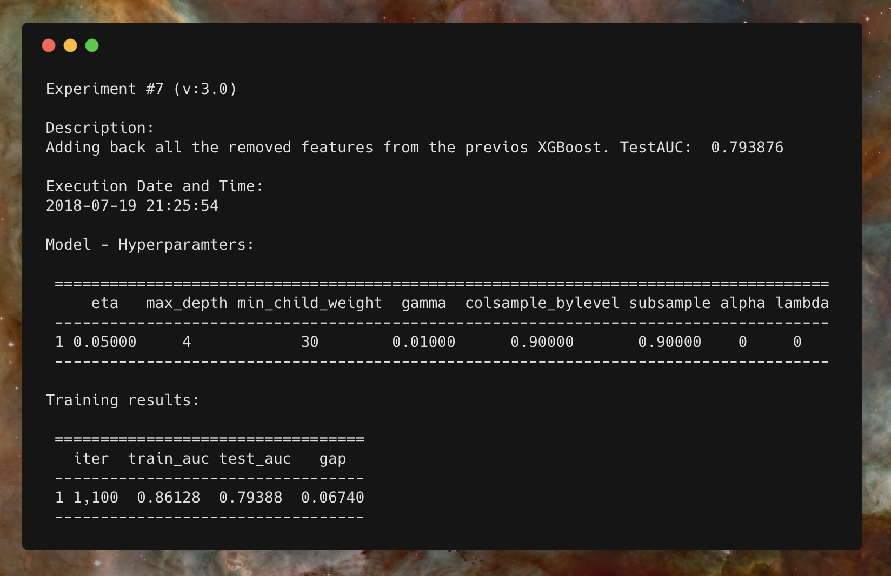

# PyStarLog

## Overview

Pyton library to entry log records to track the experiments you run, the context and its results.
A starlog or log entry was a recording entered into a starship computer record for posterity in Star Trek.



## Installation

```python
pip install --upgrade git+https://github.com/iuga/PyStarLog
```
## Usage

The following code at the end of your experiment:

```python
from starlog import log_experiment

log_experiment(
    # Entry log information:
    description = "First experiment using XGBoost",
    tag="ml", version="1.0", number=1,
    # Log all the results:
    records={
        "Final AUC": 0.789,
    }
)
```

It's going to create these files:

```
./logs/
   ./capitan.log
   ./1.0/
     ./exp.ml.1.0.1.txt
     ...
```

With the following content:

```python

Experiment #1 (v:1.0-ml)
StarDate: 2018-08-04 12:46:55

Capitan's log:
First experiment using XGBoost

Final AUC:
0.789

```

and append a entry log in the masters capitan log with the summarized content:

```
• Experiment v:1.0.1 - Stardate: 2018-08-04 12:49:21
	First experiment using XGBoost
```
